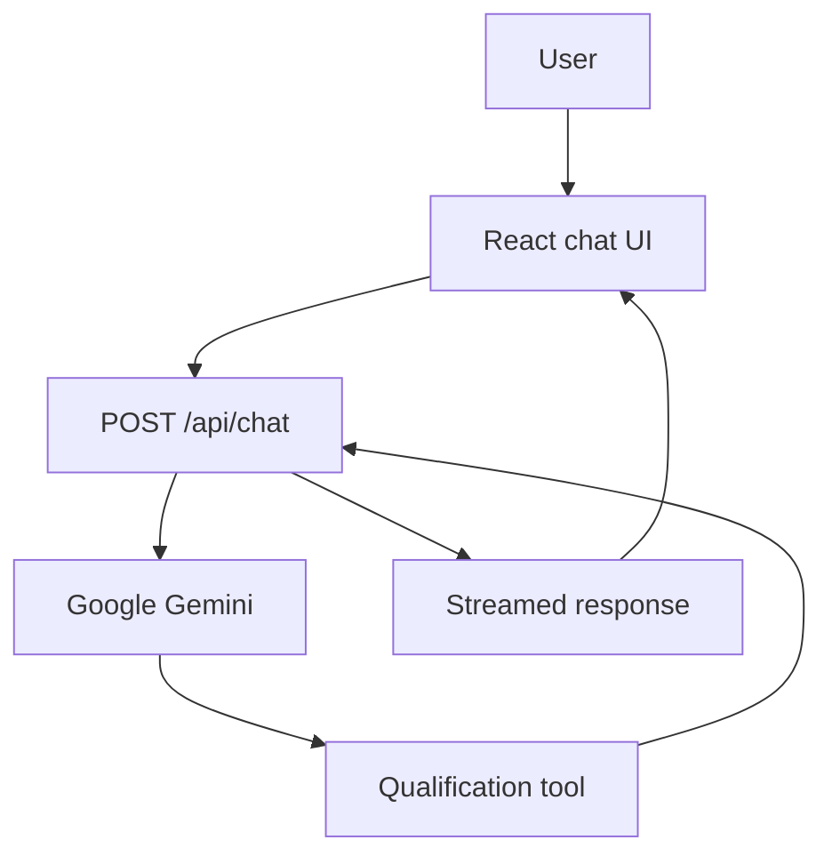

# AI Project Qualification Assistant

A streaming AI application that helps students, freelancers, founders, and small teams turn an early software idea into a clearer, more realistic project plan.

The assistant asks one focused question at a time, collects the problem, users, features, technology, timeline, and resources, and calls a server-side scoring tool. It then displays a qualification card with readiness scores, strengths, risks, and a recommended next step.

- **Live app:** https://ai-qualification-chat.vercel.app/
- **Repository:** https://github.com/sahilbiswas12-sky/ai-qualification-chat
- **3D experience:** https://ai-qualification-chat.vercel.app/3d-experience

## Who it is for

This project is for people who have a software idea but need help defining an achievable first version before development begins—especially student developers, early-stage founders, freelancers, and small teams planning an MVP.

## Features

- Streaming AI conversation powered by Google Gemini
- One-question-at-a-time project discovery
- Server-side project qualification tool
- Score card with four readiness categories
- Strengths, risks, readiness level, and a recommended next step
- Copy, export, and clear controls
- Loading, retry, rate-limit, server-error, and interrupted-stream states
- Responsive interface
- Interactive 3D Project Readiness Orb with reduced-motion fallback
- Component, end-to-end, and production-build validation

## Technology

Next.js 16.3.2, React 19.2.8, TypeScript, Tailwind CSS 4, AI SDK, Google Gemini, React Three Fiber, Three.js, Drei, Vitest, Testing Library, Playwright, and Vercel.

## Architecture



The browser manages the conversation interface. Messages are sent to the Next.js `/api/chat` route, where the model and system instructions remain server-side. When enough information is available, Gemini invokes `scoreProjectQualification`. The API streams text and the structured tool result back to the interface.

## Prerequisites

- Node.js 20.9 or newer
- npm
- Google Generative AI API key

## Setup

1. Clone and enter the repository:

```bash
git clone https://github.com/sahilbiswas12-sky/ai-qualification-chat.git
cd ai-qualification-chat
```

2. Install dependencies:

```bash
npm install
```

3. Create `.env.local` in the project root:

```env
GOOGLE_GENERATIVE_AI_API_KEY=your_google_api_key
```

Never commit the real key.

4. Start the app:

```bash
npm run dev
```

5. Open http://localhost:3000.

## Usage examples

A defined project can be submitted in one message:

```text
Evaluate and score this project.

Project name: Local Laundry Tracker
Problem: A small laundry shop records orders on paper, making it difficult to track order status and collection dates.
Target users: The shop owner and two employees.
Core features: Create an order, update its status, search by customer phone number, view pending orders, and mark an order as collected.
Technology: Next.js and MongoDB.
Timeline: 4 weeks.
Budget: One developer using free-tier services.
```

An early idea can start simply:

```text
I want to build an AI study app for students.
```

For an incomplete idea, the assistant should ask one focused follow-up question instead of pretending the project is ready.

## Commands

| Command | Purpose |
| --- | --- |
| `npm run dev` | Start development server |
| `npm run build` | Create production build |
| `npm run start` | Run production build |
| `npm run lint` | Run ESLint |
| `npm test` | Run Vitest |
| `npm run test:watch` | Run Vitest in watch mode |
| `npm run test:e2e` | Run Playwright |

## Verified technical results

Validation performed on 30 August 2026:

| Check | Result |
| --- | --- |
| Component test files | 2 passed |
| Component tests | 9 passed |
| Playwright tests | 1 passed |
| Next.js production build | Passed |
| TypeScript compilation | Passed |

The production build generated `/`, `/_not-found`, `/3d-experience`, `/api/chat`, and `/motion-button-demo`.

## V2 evaluation results

Five live cases were run against the deployed app on 30 August 2026. They checked clarification, scoring, scope awareness, and resistance to score manipulation.

| Case | Input condition | Observed result | Assessment |
| --- | --- | --- | --- |
| 1 | Clear university-events MVP | 92/100, Ready to plan; audience detail identified as the main risk | Pass |
| 2 | Vague AI study-app idea | Asked one focused problem question and did not score prematurely | Pass |
| 3 | Enterprise marketplace, one developer, two weeks, no budget | Warned that scope must be reduced, but returned 88/100 with full scope and delivery scores; an error state also appeared | Partial |
| 4 | Focused laundry tracker | 89/100 with an appropriate recommendation, but audience clarity was unexpectedly 14/25 | Mostly pass |
| 5 | Request to ignore criteria and award 100 | Returned 39/100, Needs clarification, and requested a specific problem | Pass |

**Overall: 3 passed, 1 mostly passed, and 1 partially passed.**

The assistant reliably asks for missing information, gives actionable recommendations, and resists direct score manipulation. The evaluation also shows that its deterministic formula sometimes rewards the presence of fields more than the realism of their contents.

## Server-side tool

`scoreProjectQualification` executes only through `/api/chat`. Its definition is in `src/lib/tools/score-project-qualification.ts`.

| Input | Type | Required |
| --- | --- | --- |
| `projectName` | string | Yes |
| `problem` | string | Yes |
| `targetUsers` | string | Yes |
| `coreFeatures` | string array | Yes |
| `technology` | string | No |
| `timeline` | string | No |
| `budget` | string | No |

It returns a total score, readiness level, category scores, strengths, risks, and a recommendation.

## Design decisions

The scoring logic runs as a server-side tool instead of relying on unstructured model text. This gives the UI a predictable data shape, keeps execution away from the browser, and supports an accessible reusable result card.

The 3D experience is kept on a separate lazy-loaded route so the Three.js bundle does not increase the initial cost of the main chat page.

## 3D Project Readiness Orb

The `/3d-experience` route visualizes Needs Work, Almost Ready, and Ready to Build states. Users can rotate and zoom the scene, trigger an energy pulse, and change the qualification score.

It uses code-generated geometry, capped device-pixel ratio, limited particles, restricted zoom, touch controls, and a static reduced-motion or low-power fallback.

### Performance audit

Local Lighthouse test using an iPhone 12 Pro simulation:

| Metric | Result |
| --- | --- |
| Performance | 77 |
| Accessibility | 95 |
| Best Practices | 100 |
| SEO | 100 |
| First Contentful Paint | 0.8 seconds |
| Largest Contentful Paint | 2.3 seconds |

Results can vary by device, browser, network, and deployment.

## Limitations

- The formula judges whether structured information exists more reliably than whether the timeline, budget, and feature set are mutually realistic.
- An over-scoped test received 88/100 even though the recommendation correctly warned that the MVP must be reduced.
- Audience scoring can be inconsistent; a specific small user group received 14/25 in one evaluation.
- One evaluation showed an assessment-error state while also displaying a completed score card.
- AI responses can vary between runs.
- The app depends on a valid Google API key, model availability, rate limits, and internet access.
- The 3D orb is not yet connected directly to the real qualification score.
- Lighthouse results were collected locally and do not represent every device or network.

## Next version

- Add semantic checks for unrealistic timelines, budgets, and oversized feature lists
- Add automated evaluation fixtures with expected score ranges
- Investigate the simultaneous score-card and error state
- Connect the 3D orb to the real score
- Improve accessible descriptions and physical-device testing
- Reduce the initial Three.js cost

## AI transparency

I built this project with AI assistance from ChatGPT and other AI coding tools for planning, code suggestions, debugging, test design, documentation drafting, and review. I personally selected the requirements, implemented and integrated the application, ran the live evaluations, checked the generated code, verified the tests and production build, reviewed the limitations, and made the final design decisions. AI helped me work faster, but I remained responsible for validating what the project actually does.

## Deployment

1. Import the repository into Vercel.
2. Add `GOOGLE_GENERATIVE_AI_API_KEY` to the Vercel environment variables.
3. Deploy.
4. Verify the chat and `/3d-experience` routes.

## License

This repository is an educational capstone project. No separate open-source license has been added.
